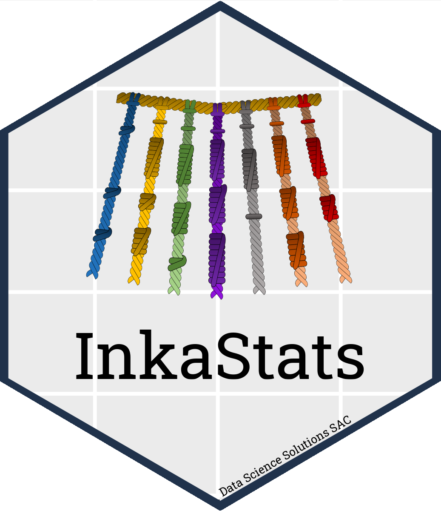
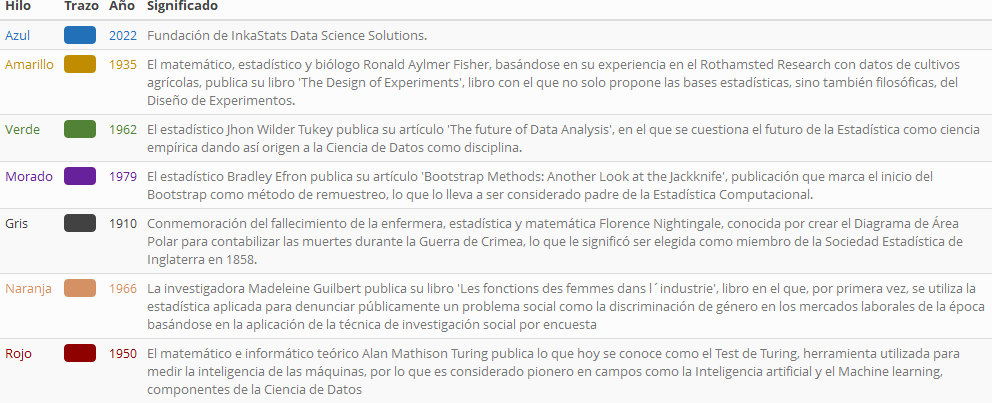

<!-- README.md is generated from README.Rmd. Please edit that file -->

```{r, include = FALSE}
knitr::opts_chunk$set(
  collapse = TRUE,
  comment = "#>"
)

options(knitr.table.format = 'html') # Conserve kable() propierties in .md documents

# Removing all objects including loaded libraries
rm(list = ls(all = TRUE))

# Installing and loading packages
if (!require("pacman")) install.packages("pacman")
if (!require("easystats")) install.packages("easystats", repos = "https://easystats.r-universe.dev")

p_unload("all") # Unloading all package except base

library(pacman)

p_load(dplyr, 
       magrittr, 
       tibble, 
       tidyr, 
       readr, 
       ggplot2,
       knitr, 
       kableExtra, 
       labelled, 
       magick, 
       webshot, 
       report) # Loading packages

# webshot::install_phantomjs()
```

> __Citación__:  Citación: Percy Soto-Becerra, Anthony Romero-Cerdán, Christian Vásquez Velasco. Hex-Sticker de InkaStats Data Science Solutions [Internet]. Zenodo; 2022 [cited 2022 Feb 22]. Available from: 110.5281/zenodo.6230964.

<a href="https://zenodo.org/badge/latestdoi/461208380"></a>

[](http://creativecommons.org/publicdomain/zero/1.0/)

# Hex-Sticker de InkaStats Data Science Solutions

<a href="https://github.com/psotob/InkaStat_HexSticker/blob/main/stickers_png/logo-inkastats-official.png"></a>

<br>
<br>
<br>
En este repositorio encontrarás el código para reproducir la creación del Hex-Sticker de **InkaStats Data Science Solutions** y la historia detrás del concepto artístico que inspiró el logo. Además, encontrarás algunas versiones alternativas de Hex-Stickers así como gifs animados.

<br>
<br>

## Arte conceptual

El `quipu` (del quechua `“quipuni”`, nudo en español) fue un sistema contable elaborado y utilizado por los administradores del imperio Inca, los quipucamayoc, a principios del siglo XVI. Consiste en un cordón grueso en la parte superior del que penden numerosos hilos verticales delgados con nudos de diferentes estilos y colores que representaban datos relacionados con la contabilidad tributaria incaica, el registro de los censos, posesión de tierras, el trabajo, la producción, entre diversos tipos de datos numéricos. Así, el `quipu` no solo funcionaba como una `base de datos`, también puede considerarsele como la representación más antigua de la `Estadística`y `Ciencia de Datos` que tenemos en América Latina.

En **InkaStats Data Science Solutions** quisimos rendirle tributo a esta milenaria herramienta de manejo y análisis de datos diseñada por los Incas, por lo que hicimos un boceto a mano de este, mediante el programa [`Canva`](https://www.canva.com/es_419/), y lo antepusimos ante un fondo generado con el paquete [`ggplot2`](https://ggplot2.tidyverse.org/) de R usando el tema predefinido `theme_gray()`, lo que generó un plano cartesiano con aspecto de piedras de construcción incaica.

Asimismo, no perdimos la oportunidad de utilizar al quipu como una base de datos y almacenar información relevante. Así, cada hilo de nuestro logo representa un año que consideramos emblemático para la Estadística y la Ciencia de Datos. Siete fechas clave han sido registradas cuyo significado se describen a continuación:

```{r, include = FALSE}
cuadro <- data.frame(
  Hilo = c("Azul", "Amarillo", "Verde", "Morado", "Gris", "Naranja", "Rojo"), 
  Trazo = rep(c("------"), 7), 
  Año = c(2022, 1935, 1962, 1979, 1910, 1966, 1950), 
  Significado = c("Fundación de InkaStats Data Science Solutions.", 
             "El matemático, estadístico y biólogo Ronald Aylmer Fisher, basándose en su experiencia en el Rothamsted Research con datos de cultivos agrícolas, publica su libro 'The Design of Experiments', libro con el que no solo propone las bases estadísticas, sino también filosóficas, del Diseño de Experimentos.", 
             "El estadístico Jhon Wilder Tukey publica su artículo 'The future of Data Analysis', en el que se cuestiona el futuro de la Estadística como ciencia empírica dando así origen a la Ciencia de Datos como disciplina.", 
             "El estadístico Bradley Efron publica su artículo 'Bootstrap Methods: Another Look at the Jackknife', publicación que marca el inicio del Bootstrap como método de remuestreo, lo que lo lleva a ser considerado padre de la Estadística Computacional.", 
             "Conmemoración del fallecimiento de la enfermera, estadística y matemática Florence Nightingale, conocida por crear el Diagrama de Área Polar para contabilizar las muertes durante la Guerra de Crimea, lo que le significó ser elegida como miembro de la Sociedad Estadística de Inglaterra en 1858.", 
             "La investigadora Madeleine Guilbert publica su libro 'Les fonctions des femmes dans l´industrie', libro en el que, por primera vez, se utiliza la estadística aplicada para denunciar públicamente un problema social como la discriminación de género en los mercados laborales de la época basándose en la aplicación de la técnica de investigación social por encuesta", 
             "El matemático e informático teórico Alan Mathison Turing publica lo que hoy se conoce como el Test de Turing, herramienta utilizada para medir la inteligencia de las máquinas, por lo que es considerado pionero en campos como la Inteligencia artificial y el Machine learning, componentes de la Ciencia de Datos"), 
  color = c("#2270B8", "#C18D00", "#528235", "#67229B", "#424242", "#D49264", "#8F0000")
  ) %>%
  as_tibble()
```

```{r echo = FALSE}
cs_dt <- cuadro
cs_dt$Hilo <- cell_spec(cs_dt$Hilo, color = cuadro$color, align = "c")
cs_dt$Trazo <- cell_spec(cs_dt$Trazo, color = cuadro$color, align = "c", background = cuadro$color)
cs_dt$`Año` <- cell_spec(cs_dt$`Año`, color = cuadro$color)

```

```{r include = FALSE}
cs_dt %>% 
  dplyr::select(Hilo, Trazo, `Año`, Significado) %>% 
  kbl(escape = F) %>% 
  kable_styling(bootstrap_options = c("striped", "hover", "condensed", "responsive")) %>%
  # as_image()
  # kable_paper("striped", full_width = FALSE) %>% 
  save_kable('tables/table_concept_art.png', density = 900)
  # kable_styling(bootstrap_options = c("striped", "hover", "condensed", "responsive")) %>%
  # as_image()
```



## Hex-Wall de Hex-Stickers alternativos

Se muestra una pared de stickers alternativos generados con el paquete [`hexwalll`](https://github.com/mitchelloharawild/hexwall) de R. Los logos alternativos se encuentra [aquí](https://github.com/psotob/InkaStat_HexSticker/tree/main/stickers_png).

```{r echo=FALSE, message=FALSE}
source("scripts/hexwall.R")

set.seed(12425)

hexwall(path = "stickers_png/",
        sticker_row_size = 4, # if getting error about "image magick" try changing #
        sticker_width = 200,
        remove_small = TRUE,
        total_stickers = NULL,
        remove_size = TRUE,
        coords = NULL,
        scale_coords = TRUE,
        sort_mode = "random"
)
```

## Gifs animados de Hex-Stickers

Por último, algunos gifs animados creados con la librería [`magick`](https://github.com/ropensci/magick), los cuales se encuentran [aquí](https://github.com/psotob/InkaStat_HexSticker/tree/main/gifs):

```{r echo = FALSE}
gif1 <- image_read("gifs/logo-charcoal-oilpaint.gif") %>% 
  image_scale("200")
gif2 <- image_read("gifs/logo-official-nonofficial.gif") %>% 
  image_scale("200")
gif3 <- image_read("gifs/logo-official-oilpaint-nonofficial.gif") %>% 
  image_scale("200")

new_gif <- image_append(c(gif1[1], gif2[1], gif3[1]), stack = FALSE)
for (i in 2:3) {
  j <- i - 1
  combined <- image_append(c(gif1[j], gif2[j], gif3[i]), stack = FALSE)
  new_gif <- c(new_gif, combined)
}

new_gif
```

## Autores

-   [Anthony Romero](https://github.com/AnthonyRomeroC) ([anthony.romeromh\@gmail.com](mailto:anthony.romeromh@gmail.com){.email})

    -   Boceto y diseño gráfico del Quipu.

    -   Co-Codeo de Hex-Sticker.

    -   Redacción de arte conceptual.

-   [Christian Vasquez](https://github.com/cvasquezvel) ([cvasquezvel\@gmail.com](mailto:cvasquezvel@gmail.com){.email})

    -   Co-creación de nombre InkaStats.

    -   Revisión y aporte con ideas al Hex-Sticker.

    -   Co-ideación de arte conceptual

-   [Percy Soto-Becerra](https://github.com/psotob) ([percys1991\@gmail.com](mailto:percys1991@gmail.com){.email})

    -   Co-creación de nombre InkaStats.

    -   Codeo de Hex-Sticker.

    -   Ideación de arte conceptual.

    -   Creación del repositorio GitHub.
    
## Librerías utilizadas

El código fuente para crear los hexstickers, hexwall y gifs animados fue escrito en el lenguaje estadístico R (version 4.1.2; R Core Team, 2021) on Windows 10 x64 (build 22000), usando los paquetes ggplot2 (version 3.3.5; Wickham. ggplot2: Elegant Graphics for Data Analysis. Springer-Verlag New York, 2016.), tidyr (version 1.2.0; Hadley Wickham and Maximilian Girlich, 2022), readr (version 2.1.2; Hadley Wickham, Jim Hester and Jennifer Bryan, 2022), dplyr (version 1.0.8; Hadley Wickham et al., 2022), kableExtra (version 1.3.4; Hao Zhu, 2021), magick (version 2.7.3; Jeroen Ooms, 2021), labelled (version 2.9.0; Joseph Larmarange, 2021), tibble (version 3.1.6; Kirill Müller and Hadley Wickham, 2021), purrr (version 0.3.4; Lionel Henry and Hadley Wickham, 2020), report (version 0.5.1; Makowski et al., 2020), pacman (version 0.5.1; Rinker et al., 2017), magrittr (version 2.0.2; Stefan Milton Bache and Hadley Wickham, 2022), webshot (version 0.5.2; Winston Chang, 2019) and knitr (version 1.37; Yihui Xie, 2021).

## Referencias Bibliográficas

-   Wong Torres Z., Salcedo Guzmán L. Quipus: nudos numéricos y parlantes. Quipucamayoc, 2005; 12(24). Disponible en: <https://doi.org/10.15381/quipu.v12i24.5435>

-   Macho Stadler M. El quipu: ¿algo más que un registro numérico? [Internet]. Cuaderno de cultura científica. 2015. Disponible en: <https://culturacientifica.com/2015/09/16/el-quipu-algo-mas-que-un-registro-numerico/>

-   Ronald Fisher. Wikipedia, La enciclopedia libre. 2022. Disponible en: <https://es.wikipedia.org/wiki/Ronald_Fisher>

-   Tukey J. The Future of Data Analysis. The Annals of Mathematical Statistics. 1962; 33(1):1–67. <doi:10.1214/aoms/1177704711>

-   Bradley E. Bootstrap Methods: Another Look at the Jackknife. The Annals of Statistics. 1979; 7(1):1-26. Disponible en: <https://www.jstor.org/stable/2958830>

-   Young P, Hortis De Smith V, Chambi M, Finn B. Florence Nightingale (1820-1910), a 101 años de su fallecimiento. Rev. méd. Chile. 2011; 139(6):807-813. Disponible en: <http://dx.doi.org/10.4067/S0034-98872011000600017>

-   Ballesteros D., Blanco F. Mujeres que aplicaron la estadística para transformar el mundo: Florence Nightingale y Madelein Guilbert. VI Congreso internacional de Historia de la Estadística y de la Probabilidad. 2011. Disponible en: <https://eprints.ucm.es/16911/>

-   Gonzales R. El test de Turing: dos mitos, un dogma. Revista de filosofía. 2007; 63:37-53. Disponible en: <http://dx.doi.org/10.4067/S0718-43602007000100003>

- H. Wickham. ggplot2: Elegant Graphics for Data Analysis. Springer-Verlag New York, 2016.

- Hadley Wickham and Maximilian Girlich (2022). tidyr: Tidy Messy Data. R package version 1.2.0. https://CRAN.R-project.org/package=tidyr

- Hadley Wickham, Jim Hester and Jennifer Bryan (2022). readr: Read Rectangular Text Data. R package version 2.1.2. https://CRAN.R-project.org/package=readr

- Hadley Wickham, Romain François, Lionel Henry and Kirill Müller (2022). dplyr: A Grammar of Data Manipulation. R package version 1.0.8. https://CRAN.R-project.org/package=dplyr

- Hao Zhu (2021). kableExtra: Construct Complex Table with 'kable' and Pipe Syntax. R package version 1.3.4. https://CRAN.R-project.org/package=kableExtra

- Jeroen Ooms (2021). magick: Advanced Graphics and Image-Processing in R. R package version 2.7.3. https://CRAN.R-project.org/package=magick

- Joseph Larmarange (2021). labelled: Manipulating Labelled Data. R package version 2.9.0. https://CRAN.R-project.org/package=labelled

- Kirill Müller and Hadley Wickham (2021). tibble: Simple Data Frames. R package version 3.1.6. https://CRAN.R-project.org/package=tibble

- Lionel Henry and Hadley Wickham (2020). purrr: Functional Programming Tools. R package version 0.3.4. https://CRAN.R-project.org/package=purrr

- Makowski, D., Ben-Shachar, M.S., Patil, I. & Lüdecke, D. (2020). Automated Results Reporting as a Practical Tool to Improve Reproducibility and Methodological Best Practices Adoption. CRAN. Available from https://github.com/easystats/report. doi: .

- R Core Team (2021). R: A language and environment for statistical computing. R Foundation for Statistical Computing, Vienna, Austria. URL https://www.R-project.org/.

- Rinker, T. W. & Kurkiewicz, D. (2017). pacman: Package Management for R. version 0.5.0. Buffalo, New York. http://github.com/trinker/pacman

- Stefan Milton Bache and Hadley Wickham (2022). magrittr: A Forward-Pipe Operator for R. R package version 2.0.2. https://CRAN.R-project.org/package=magrittr

- Winston Chang (2019). webshot: Take Screenshots of Web Pages. R package version 0.5.2. https://CRAN.R-project.org/package=webshot

- Yihui Xie (2021). knitr: A General-Purpose Package for Dynamic Report Generation in R. R package version 1.37.

## Licencia 

Creative Commons CC0 Public Domain
